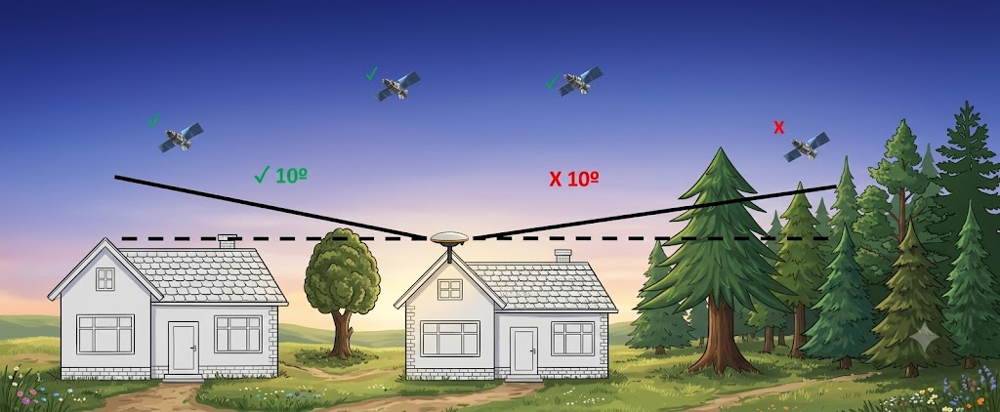

---
layout:
  width: default
  title:
    visible: false
  description:
    visible: true
  tableOfContents:
    visible: true
  outline:
    visible: true
  pagination:
    visible: true
  metadata:
    visible: true
  tags:
    visible: true
  actions:
    visible: true
---

# Mounting & Placement Tips

## 📍 Mounting & Placement Tips

Where you place your antenna is just as important as which antenna you choose. A perfectly calibrated antenna on a bad location will still produce poor results.

***

### The Golden Rule: Sky View

Your antenna needs a **clear, unobstructed view of the sky in all directions.**

The minimum requirement:

> No obstructions above **10 degrees elevation** in any direction — 360 degrees around the antenna.

#### How to check 10 degrees elevation:

Make a fist and stretch your arm out horizontally. Hold the **bottom of your fist** level with the horizon. The **top of your fist** now points to approximately 10 degrees above the horizon.

Rotate slowly in a full circle — anything that appears above your fist (buildings, trees, mountains) is an obstruction that will affect your signal.

<figure><figcaption></figcaption></figure>

***

### Best Location: Rooftop

✅ **Rooftop mounting is strongly recommended.**

A rooftop position typically gives you:

* Maximum sky visibility
* Minimal multipath from surrounding objects
* Distance from electronic interference sources

***

### What to Avoid

| Obstruction           | Why It's a Problem                 |
| --------------------- | ---------------------------------- |
| Buildings / walls     | Block satellite signals below 10°  |
| Trees                 | Absorb and scatter GPS signals     |
| Mountains / hills     | Hard horizon obstruction           |
| Metal surfaces nearby | Cause strong multipath reflections |
| Windows (indoor)      | Glass blocks many GNSS frequencies |
| Under roof overhangs  | Cuts off large parts of the sky    |

***

### Antenna Must Be Rigidly Mounted

This is critical for onocoy rewards.

> ⚠️ **The antenna must not move more than 1–2 millimeters — even in heavy weather.**

onocoy validators **continuously monitor** the position of your antenna. If they detect too much movement or vibration, your rewards will be **automatically degraded.**

**Use:**

* ✅ Solid mast or pole mount
* ✅ Concrete wall bracket
* ✅ Roof mount with strong base
* ❌ No temporary setups
* ❌ No flexible or wobbly mounts

***

### Signal Environment

Beyond obstructions, the radio environment matters:

* Keep antenna away from WiFi routers & antennas
* Avoid mounting near air conditioning units
* Avoid mounting near satellite TV dishes
* Distance from power lines if possible

> 💡 A clean RF environment means cleaner GNSS signals and better correction data.

***

***
