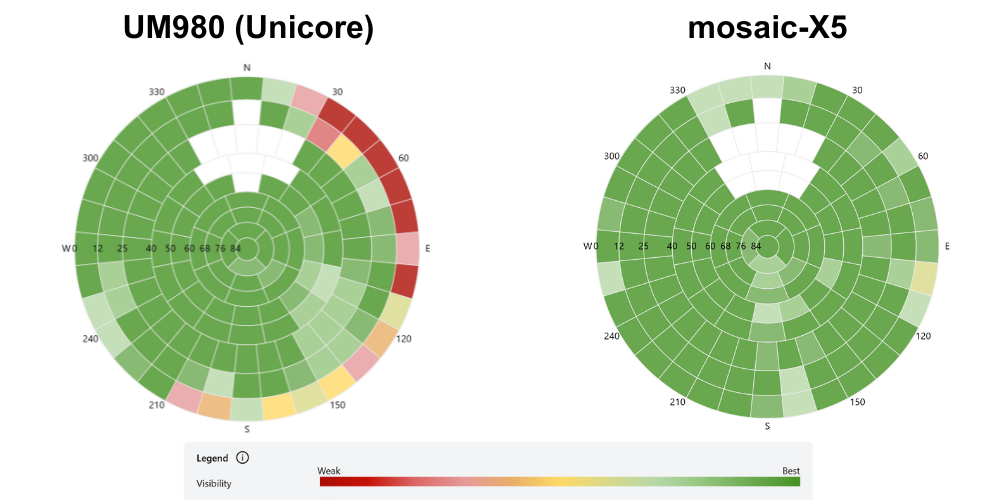
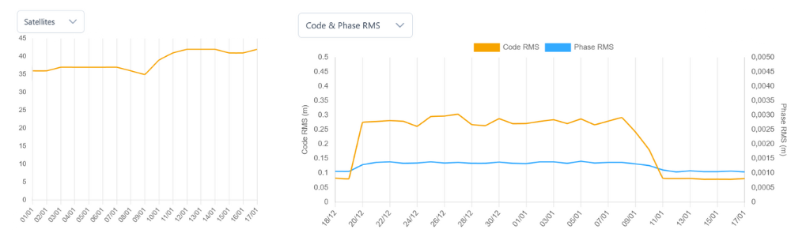
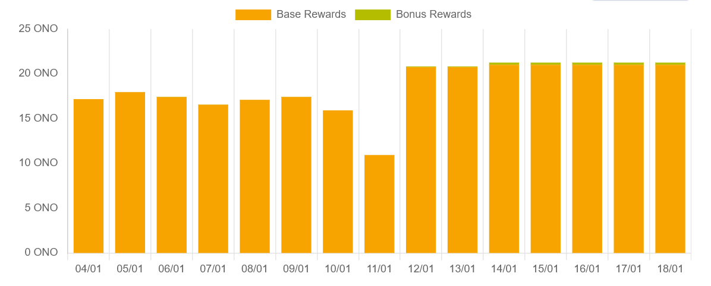

---
layout:
  width: default
  title:
    visible: false
  description:
    visible: true
  tableOfContents:
    visible: true
  outline:
    visible: true
  pagination:
    visible: true
  metadata:
    visible: true
  tags:
    visible: true
  actions:
    visible: true
---

# Performance Metrics & Real Data

## 📊 Performance Metrics & Real Data

> The following data comes from a real-world upgrade test conducted by **Thomas Gretz**, onocoy Tech Ambassador. Same antenna, same location — only the receiver was swapped.

***

### The Test Setup

To answer the question: **"How much difference does a better GNSS receiver actually make?"**

One base station was upgraded from **UM980 → Mosaic-X5** while keeping antenna, site and installation 100% identical. This isolates the receiver effect completely.

**Test conditions:**

* 📍 Same location
* 📡 Same antenna
* 🔌 Same Raspberry Pi controller
* 🌐 Same internet connection
* ⏱️ Measured over multiple days

***

### Quality Scale & Availability

<figure><figcaption></figcaption></figure>

| Metric        | UM980       | Mosaic-X5 | Improvement |
| ------------- | ----------- | --------- | ----------- |
| Availability  | 1.00 ✅      | 1.00 ✅    | —           |
| Quality Scale | 0.79 – 0.82 | \~0.97    | +18-23% ✅   |

> 📈 A higher quality scale directly translates into higher daily ONO rewards.

***

### Satellite Tracking (Sky Plot)

<figure><figcaption></figcaption></figure>

| Aspect                     | UM980      | Mosaic-X5   |
| -------------------------- | ---------- | ----------- |
| Low elevation tracking     | Incomplete | Complete ✅  |
| Sky plot density           | Moderate   | Dense ✅     |
| Overall satellite coverage | Good       | Excellent ✅ |

* **UM980:** Some satellite tracks incomplete, especially at low elevation angles
* **Mosaic-X5:** Significantly denser sky plot, more satellites tracked reliably at all elevations

***

### Code RMS & Phase RMS

<figure><figcaption></figcaption></figure>

| Metric    | UM980      | Mosaic-X5  | Improvement |
| --------- | ---------- | ---------- | ----------- |
| Code RMS  | \~0.29 m   | \~0.09 m   | \~69% ✅     |
| Phase RMS | \~0.0014 m | \~0.0010 m | \~29% ✅     |

> 📉 Code RMS improved by \~69% — a massive leap in raw precision. This directly improves your onocoy quality score.

***

### ONO Rewards Impact 💰

<figure><figcaption></figcaption></figure>

| Reward Type   | Change                |
| ------------- | --------------------- |
| Base Rewards  | ⬆️ Noticeably higher  |
| Bonus Rewards | ⬆️ Noticeably higher  |
| Consistency   | ⬆️ More stable output |

> 💡 Better data quality = directly higher ONO rewards. The upgrade pays for itself over time.

***

### Conclusion

> _"My switch from UM980 to Mosaic X5 was a measurable leap — in tech metrics and economic results — without any site changes."_
>
>

***

📖 **Want to dive deeper into the full analysis?** \
Read the complete article on LinkedIn \
→ [GNSS Hardware Matters: The Measurable Impact of Upgrading on onocoy](https://www.linkedin.com/pulse/gnss-hardware-matters-measurable-impact-upgrading-onocoy-gretz-dnuqf/)
